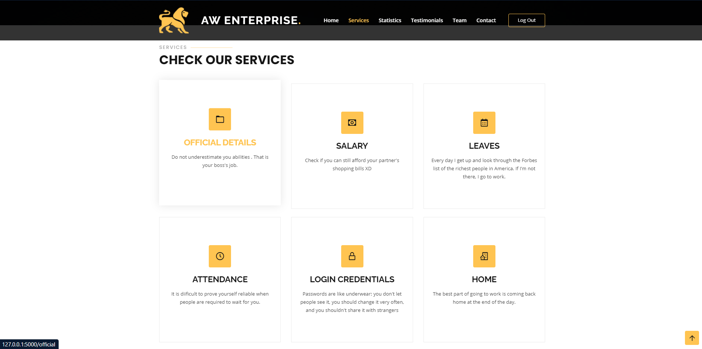

# Employee-Management-System
## Introduction
Usually, large companies and organizations have a vast army of human resources working under them. The Employee management system is a distributed application that helps us overcome the problems faced due to manual system. The objective of this project is to provide a comprehensive approach towards the management of employee information.

## Features
- This application aims to simplify the task of maintain the records of employees of a company in a well-designed database.
- Provides full functional reports to manage the company.
- It calculates the employee salary
- It helps in easy attendance marking.
- Easy calculation of various leaves in categories
- Computerized events and requests management
- Creates new users to the system according

## Demo
### Login 

### Registration

### Home Page

### Services

### Statistics

### Testimonials

### Team

### Contact Us

### Official Details

                                                                                                                 
### Salary

                                                                                                                 
### Leaves

                                                                                                                 
### Attendance

                                                                                                                 
### Login Credentials

## Tech Stacks:
- Frontend: HTML, CSS and Bootstrap
- Backend: Flask, Python3
- Database: SQLite for Employee database

## Contributors:
- <a href="https://github.com/AakritiKinra">Aakriti Kinra</a>
- <a href="https://github.com/wamica22">Wamica Walia</a>
